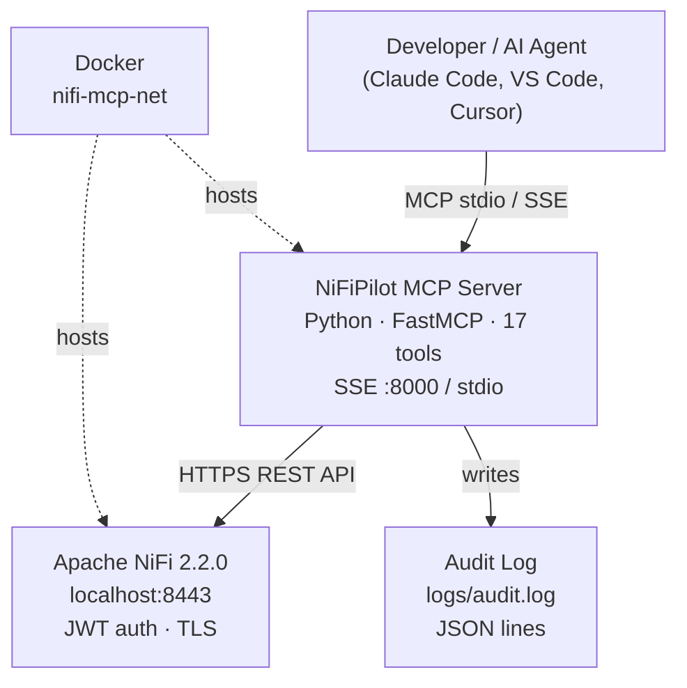
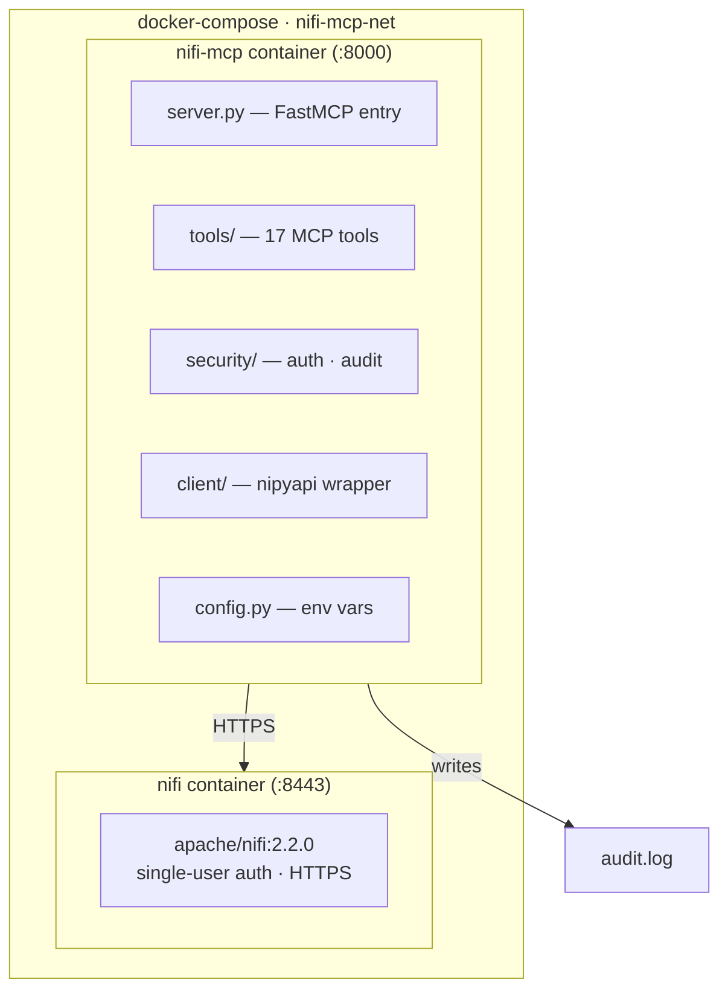
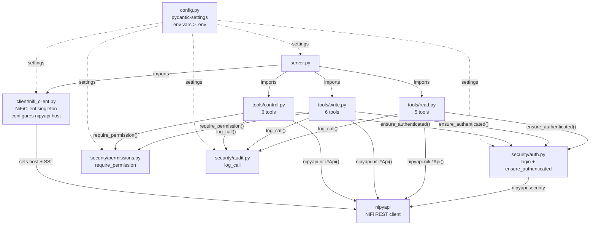

# Architecture — NiFiPilot

## C4 diagrams

### C1 — System context



### C2 — Containers (docker-compose stack)



### C3 — Components (nifi-mcp internals)



---

## Design decisions

### ADR-001 — Auth: per-tool ensure_authenticated (Option B over Option A)

**Context:** Tools call nipyapi directly. NiFiClient exists but is not yet the façade.

**Decision:** Each tool calls `ensure_authenticated()` as its first line instead of routing all calls through `NiFiClient` methods.

**Why B over A:** Refactoring all tools to go through the client would require touching every tool file plus the client, with no safety net of integration tests against a live NiFi. Option B adds auth protection in one small, auditable change per file, keeps the blast radius small, and leaves the architecture free to evolve.

**Trade-off accepted:** `ensure_authenticated()` is duplicated in every tool rather than enforced in one place. This is conscious technical debt — see ADR-003.

---

### ADR-002 — Lazy auth (first real call, not startup)

**Context:** The MCP server starts before NiFi is ready, especially in Docker Compose where `depends_on` with healthcheck means NiFi may still be initializing when the MCP container boots.

**Decision:** `NiFiClient.__init__` does not call `login()`. Auth happens on the first tool invocation via `ensure_authenticated()`.

**Why:** Calling `login()` at import/startup would fail and prevent the server from starting at all, even though NiFi would be reachable seconds later. Lazy auth makes the server resilient to NiFi startup order.

---

### ADR-003 — NiFiClient as real façade (planned refactor)

**Current state:** Tools call nipyapi directly. `NiFiClient` configures the nipyapi host at startup (via the import in `server.py`) but is not used by tools for actual API calls.

**Planned refactor** (when integration tests exist):

1. Move each nipyapi call into a typed method on `NiFiClient`.
2. Decorate those methods with `@_with_auth` (already in place).
3. Tools call `client.<method>()` — auth, logging, and error handling in one place.
4. Remove per-tool `ensure_authenticated()` calls.

Until that refactor happens, Option B (ADR-001) provides equivalent protection.

---

### ADR-004 — nipyapi host initialization via server.py import

**Problem discovered:** nipyapi has `https://localhost:9443` as its internal default host. If `NiFiClient` is not instantiated before a tool call, nipyapi uses that default and all calls fail.

**Solution:** `server.py` imports `client` from `nifi_client.py` at startup. This triggers `NiFiClient.__init__`, which overwrites the nipyapi host with the value from `NIFI_URL`. Import order guarantees this runs before any tool is called.

**Why not in config.py or auth.py:** Those modules don't know about nipyapi. The responsibility belongs to the client layer.

---

### ADR-005 — Healthcheck uses HTTP status codes 200 and 401

**Context:** NiFi 2.x requires authentication for `/nifi-api/system-diagnostics`. The curl-based healthcheck in docker-compose was failing because `-f` (fail on error) treats 401 as failure.

**Decision:** The healthcheck accepts both 200 and 401 as signals that NiFi is alive and responding.

```yaml
test: ["CMD-SHELL", "curl -sk -o /dev/null -w '%{http_code}' https://nifi:8443/nifi-api/system-diagnostics | grep -qE '(200|401)' || exit 1"]
```

**Why:** A 401 means NiFi is up and enforcing auth — that's healthy. The MCP server authenticates separately via JWT, not via the healthcheck endpoint.

---

## Known technical debt

| Item | Priority | Notes |
|------|----------|-------|
| Rate limiting not enforced | Medium | `MCP_RATE_LIMIT` config exists but no middleware applies it |
| `NiFiClient` not used by tools | Medium | See ADR-003 — planned refactor when integration tests exist |
| No integration tests | Medium | Tests mock nipyapi; no tests against live NiFi |
| `test_auth.py` covers auth module only | Low | Tool-level auth path not covered by tests |

---

## Stack

| Layer | Technology |
|-------|-----------|
| MCP framework | fastmcp 3.4.2 |
| NiFi client | nipyapi 1.5.1 + httpx |
| Config | pydantic-settings |
| Tests | pytest + unittest.mock |
| Lint | ruff |
| Packaging | hatchling |
| Runtime | Python 3.11 · Docker · docker-compose |
