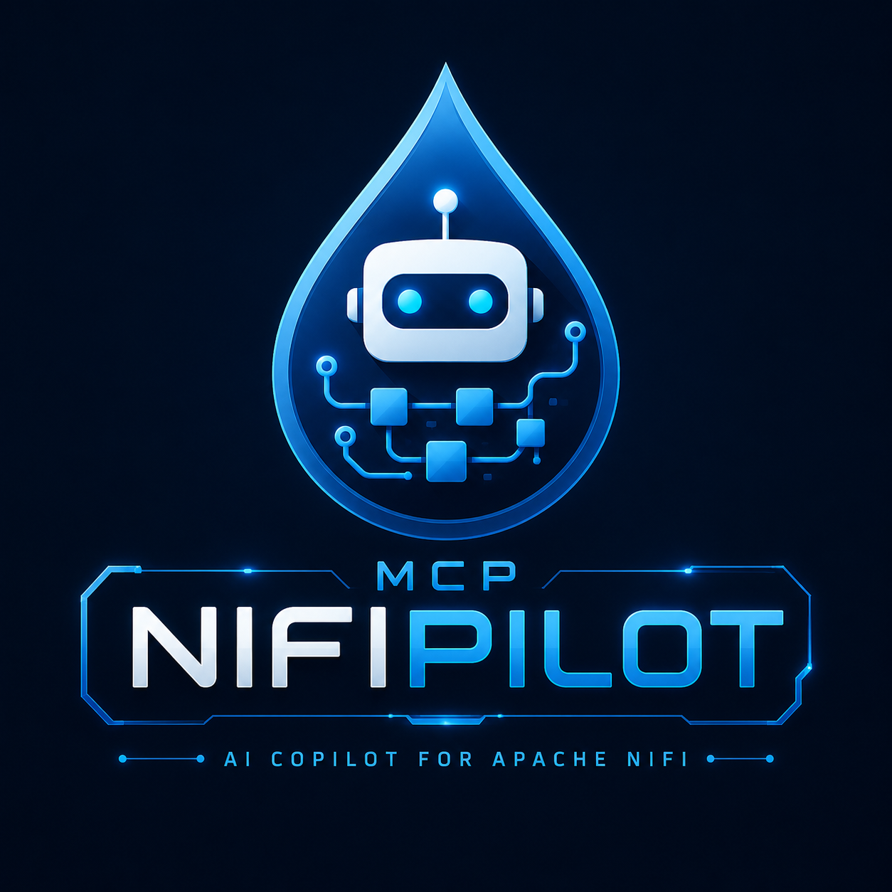

# NiFiPilot — AI Copilot for Apache NiFi

MCP (Model Context Protocol) server for Apache NiFi 2.2.0. Lets AI agents inspect, build, and control NiFi flows safely and auditably via 17 ready-to-use tools.

[](tests/)
[](pyproject.toml)
[](LICENSE)
[](https://nifi.apache.org)

---

## What it does

NiFiPilot exposes Apache NiFi's REST API as MCP tools so any compatible AI agent can:

- **Inspect** running flows, processor states, queue depths, and system health
- **Build** process groups, processors, and connections from natural language
- **Control** start/stop individual processors or entire process groups
- **Audit** every action — every tool call is written to a structured JSON log

---

## Features

- **17 tools** across three categories: read (5), write (6), control (6)
- **Readonly mode** — write and control tools are blocked; safe for production monitoring
- **Dry-run mode** — preview write/control actions without executing them
- **Structured audit log** — every tool call logged with params, result, and timestamp
- **Lazy authentication** — JWT token acquired on first call, refreshed automatically on 401
- **Transports** — stdio (local clients) and SSE (Docker/remote)
- **36 unit tests** — no live NiFi required

---

## Quick start with Docker Compose

The bundled compose file starts NiFi 2.2.0 and the MCP server together.

```bash
# 1. Copy and edit the env file
cp .env.example .env
# Edit NIFI_PASSWORD (min 12 chars) and set MCP_MODE=full to allow write/control

# 2. Start both services
docker compose up --build

# 3. NiFi UI:  https://localhost:8443  (first start takes ~2 min)
#    MCP SSE:  http://localhost:8000/sse
```

Connect any MCP-compatible client to the SSE endpoint:

```json
{
  "mcpServers": {
    "nifi-mcp": { "url": "http://localhost:8000/sse" }
  }
}
```

---

## Manual installation

**Requirements:** Python 3.11+

```bash
# From source
git clone https://github.com/Giojacke/mcp-nifipilot
cd mcp-nifipilot
pip install .
```

Run in stdio mode (used by Claude Code, VS Code, Cursor):

```bash
NIFI_URL=https://localhost:8443 \
NIFI_USERNAME=admin \
NIFI_PASSWORD=your-password \
NIFI_VERIFY_SSL=false \
MCP_MODE=readonly \
nifi-mcp
```

---

## Configuration

All settings come from environment variables (or a `.env` file in the working directory).

| Variable             | Default                  | Description                                      |
|----------------------|--------------------------|--------------------------------------------------|
| `NIFI_URL`           | `https://localhost:8443` | NiFi base URL                                    |
| `NIFI_USERNAME`      | `admin`                  | NiFi username                                    |
| `NIFI_PASSWORD`      | _(required)_             | NiFi password (min 12 chars for single-user auth)|
| `NIFI_VERIFY_SSL`    | `false`                  | Verify TLS certificate (`true` in production)    |
| `MCP_MODE`           | `readonly`               | `readonly` — read tools only; `full` — all tools |
| `MCP_AUDIT_LOG`      | `true`                   | Write JSON audit log                             |
| `MCP_AUDIT_LOG_PATH` | `./logs/audit.log`       | Path for the audit log file                      |
| `MCP_RATE_LIMIT`     | `60`                     | Max tool calls per minute                        |
| `MCP_DRY_RUN`        | `false`                  | Describe write/control actions without executing |
| `MCP_TRANSPORT`      | `stdio`                  | `stdio` for local clients; `sse` for Docker      |
| `MCP_HOST`           | `0.0.0.0`                | Bind host when `MCP_TRANSPORT=sse`               |
| `MCP_PORT`           | `8000`                   | Port when `MCP_TRANSPORT=sse`                    |

---

## Tool reference

### Read tools _(always available)_

| Tool | Description |
|------|-------------|
| `get_process_groups(group_id)` | List direct child process groups |
| `get_processors(group_id)` | List processors in a group with run status |
| `get_connections(group_id)` | List connections with queue depth |
| `get_flow_status(group_id)` | Running/stopped/invalid counts and throughput |
| `get_system_diagnostics()` | NiFi version, heap, CPU, uptime |

### Write tools _(require `MCP_MODE=full`)_

| Tool | Description |
|------|-------------|
| `create_process_group(name, parent_group_id, x, y)` | Create a new process group |
| `create_processor(name, processor_type, group_id, x, y)` | Add a processor (full Java class name) |
| `update_processor(processor_id, name?, properties?, scheduling_period?)` | Update processor config |
| `create_connection(source_id, destination_id, group_id, relationships?, ...)` | Connect two components |
| `delete_processor(processor_id)` | Delete a stopped processor |
| `delete_process_group(group_id)` | Delete a stopped process group |

### Control tools _(require `MCP_MODE=full`)_

| Tool | Description |
|------|-------------|
| `start_processor(processor_id)` | Start a processor |
| `stop_processor(processor_id)` | Stop a processor |
| `start_process_group(group_id)` | Start all processors in a group |
| `stop_process_group(group_id)` | Stop all processors in a group |
| `get_queue_status(connection_id)` | Queue depth and throughput |
| `purge_queue(connection_id)` | Drop all flowfiles from a queue |

---

## Client setup

### Claude Code (stdio)

The `.mcp.json` at the project root is pre-configured. Fill in your password:

```jsonc
{
  "mcpServers": {
    "nifi-mcp": {
      "command": "nifi-mcp",
      "env": {
        "NIFI_URL": "https://localhost:8443",
        "NIFI_USERNAME": "admin",
        "NIFI_PASSWORD": "YOUR_PASSWORD",
        "NIFI_VERIFY_SSL": "false",
        "MCP_MODE": "readonly"
      }
    }
  }
}
```

### Claude Code (SSE — Docker stack running)

```jsonc
{
  "mcpServers": {
    "nifi-mcp": { "url": "http://localhost:8000/sse" }
  }
}
```

### VS Code

Copy `.vscode/mcp.json` (included) and fill in your password.

### Cursor / Windsurf

Place the stdio config at `~/.cursor/mcp.json` (global) or `.cursor/mcp.json` (project).

---

## Security model

| Concern | Mitigation |
|---------|-----------|
| Credential exposure | All secrets via env vars — never hardcoded |
| Accidental writes | `MCP_MODE=readonly` blocks all write and control tools |
| Runaway changes | `MCP_DRY_RUN=true` describes actions without executing |
| Auditability | Every tool call writes a JSON entry to the audit log |
| Token expiry | `ensure_authenticated()` re-logins on 401 automatically |
| SSL in production | Set `NIFI_VERIFY_SSL=true` with a valid certificate |

---

## Development

```bash
# Install with dev dependencies
pip install -e ".[dev]"

# Run tests (no live NiFi needed)
pytest

# Lint and format
ruff check src tests
ruff format src tests
```

Tests mock nipyapi at the API class level — 36 tests, no live NiFi required. Integration tests can be added in `tests/integration/` (excluded from the default test run).

---

## Architecture

See [ARCHITECTURE.md](ARCHITECTURE.md) for design decisions and the C4 diagrams.

---

## Roadmap

- [ ] Rate limiting enforcement (config exists, middleware pending)
- [ ] `NiFiClient` as real façade (tools currently call nipyapi directly)
- [ ] Integration tests against live NiFi
- [ ] Azure DevOps MCP bridge for CI/CD of NiFi flows

---

## License

MIT
